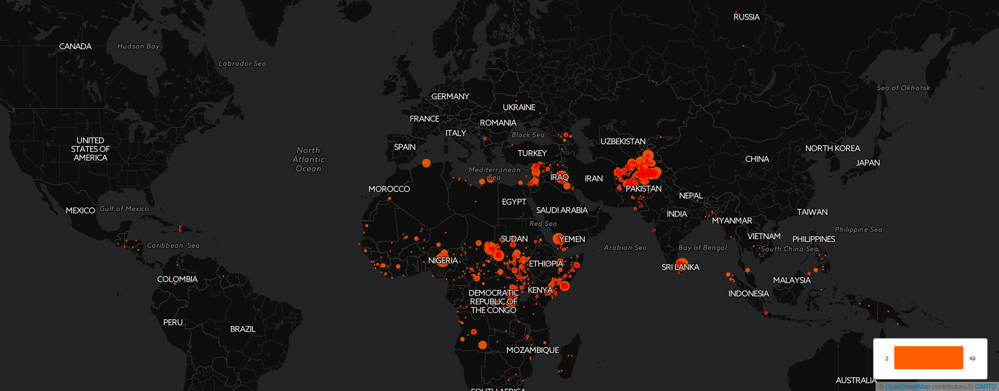
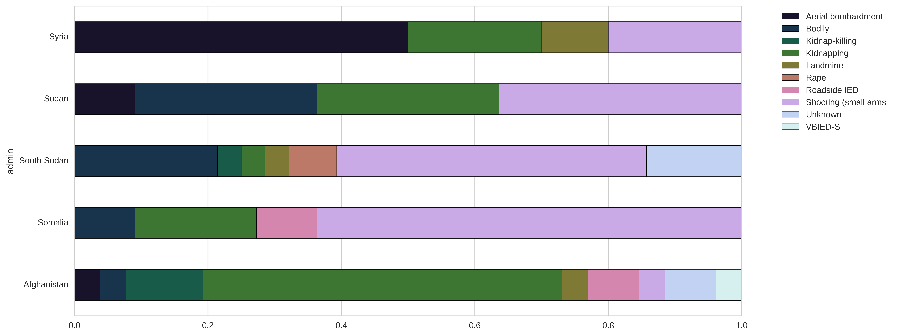

# Humanitarian Security

## Summary 
This repository provides a comprehensive analysis of major violent incidents directed against humanitarian aid workers. The analysis is based on data colelcted by the Aid Worker Security Database (AWSD), available at https://aidworkersecurity.org/. The dataset contains more than 2000 incidents that have been reported since 1997 until today. This quantitative research aims to shed light on the crucial issue of the security of civilian aid workers in fragile contexts. Because high insecurity for aid workers may significantly reduce access to a needy population and limit both the amount and quality of aid provided. 
assdad

***Key Outcome:*** 
* Risks to humanitarian aid workers are power law distributed. A small number of insecure locations (Afghanistan, Sudan, Somalia, Syria and Pakistan) account for most of the incidents.

* Over the last fifteen years the number of serious incidents has continously increased and is now more than 6 times higher than 10 years ago. 
* The increase of attacks has primarily affected national humanitarian aid workers!

* The increase of attacks has primarily affected national humanitarian aid workers!

## Data source
For each incident, the database records the:

* Date
* Country and specific location, including geocodes
* Number of aid workers affected (victims)
* Sex of victims
* Institutional affiliation of victims (UN/Red Cross/NGO/other)
* Type of staff (national or international)*
* Outcome of the incident (victims killed/wounded/kidnapped)
* Means of violence (e.g. shooting, IED, aerial bombardment)
* Context of attack (ambush, armed incursion, etc.)
* Summary of incident (public details)

## Future steps
The next steps of this analysis will be to create a spatial regression model to understand the relationship between local context, incidents and consequences on aid provision (such as suspensions of programmes and withdrawals). 

## License
The MIT License (MIT)
Copyright (c) 2016 Philipp Schwarz
